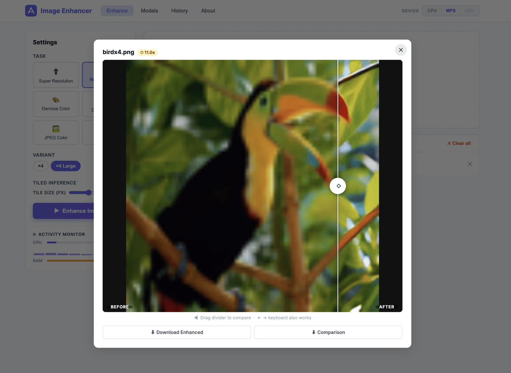

# Image Enhancer

A full-featured web application for image restoration using **SwinIR** (Swin Transformer for Image Restoration), built with Flask, PyTorch, and a clean responsive UI.



---

## Features

| Task | Options |
|---|---|
| **Super Resolution** | Classical ×2, ×3, ×4, ×8 · Real-World ×4 (standard & large) |
| **Denoising** | Colour σ=15/25/50 · Grayscale σ=15/25/50 |
| **JPEG Artifact Reduction** | Colour Q10/20/30/40 · Gray Q10/20/30/40 |

- **Drag-and-drop UI** with live progress via Server-Sent Events (SSE)
- **Automatic model download** — weights fetched from GitHub Releases on first use and cached locally
- **Tiled inference** — tile size auto-snapped to the nearest `window_size` multiple; process any resolution without OOM errors
- **Before/After drag slider** — click any result to compare original vs enhanced with a smooth interactive divider
- **Processing time** — per-image inference time shown on result cards, in the modal, and stored in history
- **Job history** — all completed jobs persisted to `history.json`; browse, preview, and delete individual results or entire jobs
- **Activity Monitor** — real-time CPU %, per-core spark bars, and RAM usage in the Settings panel while inference runs
- **Wide format support** — JPG, PNG, BMP, TIF, WebP, EXR, HDR, JP2, AVIF, HEIC, PBM/PGM/PPM, GIF, ICO and more
- **PSNR / SSIM metrics** computed when a ground-truth reference is available
- **Device selector** — choose CPU, MPS (Apple Silicon), or CUDA GPU from the header; app auto-detects and recommends the best available device
- **Fine-tuning** via `train.py` with cosine LR scheduling and checkpoint saving

---

## Quick Start

### 1. Install dependencies

```bash
pip install -r requirements.txt
```

> **macOS note:** Port 5000 is taken by AirPlay Receiver. The app defaults to **port 8080**.
> Disable AirPlay Receiver in *System Settings → General → AirDrop & Handoff* if you prefer port 5000.

### 2. Run the web app

```bash
python app.py
# or specify host/port:
python app.py --host 127.0.0.1 --port 8080
```

Open **http://localhost:8080** in your browser.

### 3. Enhance images

1. Select a **device** in the header (CPU / MPS / GPU) — the best available is auto-selected
2. Select a **task** (e.g. Super Resolution)
3. Pick a **variant** (e.g. ×4)
4. Drop or browse image files — any common format accepted
5. (Optional) adjust **Tile Size** — snapped to a valid multiple automatically
6. Click **Enhance Images** — model downloads on first run, then inference starts
7. Watch the **Activity Monitor** for live CPU/RAM feedback during inference
8. Click any result card to open the **before/after slider**; download from the modal or the card

> **CPU inference is slow** — a 512×512 image through a denoiser or JPEG model typically takes 5–15 minutes on CPU.  
> On **Apple Silicon (M1/M2/M3)** select **MPS** in the device selector for ~5–15× faster inference using the Metal GPU.  
> On machines with an NVIDIA GPU, select **GPU (CUDA)** for the fastest results.

---

## UI Panels

### Enhance
The main workspace. Upload images, choose task and variant, run inference, and view results. Each result card shows the output image, dimensions, processing time, and optional PSNR/SSIM chips. Click a card to open a full-size **before/after drag slider** in a modal.

### History
All completed jobs are saved to `history.json` and visible here across server restarts. Each job is collapsible and shows every result with its thumbnail, dimensions, processing time, and metrics. Individual result files can be deleted from disk; entire job entries can be removed from history.

### Models
Shows all 24 pretrained model variants and their local download status (filename, size on disk). Includes a button to clear the in-memory model cache.

### About
Task descriptions, training instructions, and project structure reference.

---

## Activity Monitor

Located at the bottom of the Settings panel. Polls `/api/system` every 3 seconds while the page is open.

| Indicator | Description |
|---|---|
| **Status dot** | Gray = idle · Green pulse = job running · Amber pulse = CPU ≥ 80% |
| **CPU bar** | Overall CPU % (0.3 s blocking measurement per poll) |
| **Per-core sparks** | One column per logical core — height reflects load |
| **RAM bar** | Used / total GiB |
| **Active job box** | Current file being processed + elapsed time |

**Troubleshooting:** if the monitor shows 0% and 0G, `psutil` is not installed in your virtualenv:
```bash
pip install psutil
```
Verify with: `http://localhost:8080/api/system/debug`

---

## Device Selector

The **Device** button group in the top-right header lets you choose which compute device SwinIR runs on. On page load the app queries `/api/devices` and automatically enables only the devices available on your machine.

| Button | Colour when active | When available |
|---|---|---|
| **CPU** | Blue | Always |
| **MPS** | Purple | Apple Silicon (M1 / M2 / M3 / M4) |
| **GPU** | Green | NVIDIA CUDA GPU |

### Recommended devices by machine

| Machine | Recommended | Typical 512×512 time |
|---|---|---|
| Apple M1 / M2 / M3 iMac, MacBook | **MPS** | 20–60 s |
| Linux / Windows with NVIDIA GPU | **GPU** | 2–10 s |
| Any machine, no GPU | **CPU** | 5–15 min |

MPS uses Apple's **Metal Performance Shaders** framework to run the model on the M1/M2/M3 GPU cores — typically 5–15× faster than CPU on the same chip.

> **Note:** switching devices mid-session keeps both model copies in memory. Use **Models → Clear memory cache** to free the previous device's copy.

---

## Project Structure

```
swinir_app/
├── app.py                  # Flask server, all API routes, background job runner
├── train.py                # Fine-tuning script (PSNR/SSIM eval, checkpoints)
├── config.py               # All 24 task/model configs — single source of truth
├── history.json            # Auto-created; persists completed job results
├── requirements.txt
│
├── models/
│   └── network_swinir.py   # Official SwinIR architecture (patched for timm ≥ 0.9)
│
├── core/
│   ├── __init__.py
│   ├── inference.py        # Image loading → padding → tiled/whole inference → save
│   └── model_manager.py    # Download, in-memory cache, model builder
│
├── utils/
│   ├── __init__.py
│   ├── metrics.py          # PSNR, SSIM (RGB and Y-channel)
│   ├── image_utils.py      # I/O helpers, grayscale-safe comparison builder
│   └── logger.py           # Centralised logging
│
├── static/
│   ├── css/style.css       # Full UI stylesheet incl. slider, monitor, history
│   └── js/app.js           # Upload, SSE progress, before/after slider, monitor
│
├── templates/
│   └── index.html          # 4-panel SPA (Enhance / History / Models / About)
│
├── pretrained_models/      # Auto-downloaded .pth weights (gitignored)
├── uploads/                # Temporary user uploads
├── outputs/                # Enhanced PNGs + comparison images
└── data/
    ├── train/
    │   ├── hr/             # Ground-truth training images
    │   └── lr/             # Optional pre-degraded LR images
    └── val/
        ├── hr/
        └── lr/
```

---

## Fine-Tuning (`train.py`)

Prepare a paired dataset under `data/`:

```
data/
  train/
    hr/   ← ground-truth images (any format)
    lr/   ← optional pre-degraded versions; synthesised on-the-fly if absent
  val/
    hr/
    lr/
```

Run fine-tuning:

```bash
# Classical SR ×4, initialised from official pretrained weights
python train.py --task classical_sr --variant x4 --epochs 100

# Colour denoiser σ=25, smaller batch
python train.py --task color_dn --variant noise25 --batch_size 4 --epochs 50

# JPEG colour Q40
python train.py --task color_jpeg_car --variant q40 --epochs 80

# Resume from checkpoint
python train.py --task classical_sr --variant x2 \
    --resume checkpoints/classical_sr_x2_epoch20.pth

# Train from scratch (no pretrained weights)
python train.py --task real_sr --variant x4 --no_pretrained
```

**Arguments:**

| Argument | Default | Description |
|---|---|---|
| `--task` | required | `classical_sr` · `real_sr` · `gray_dn` · `color_dn` · `jpeg_car` · `color_jpeg_car` |
| `--variant` | required | `x2` / `x4` / `noise25` / `q40` … (see `config.py`) |
| `--pretrained` | `True` | Load official pretrained weights before training |
| `--no_pretrained` | — | Train from random init |
| `--resume` | `None` | Path to `.pth` checkpoint to resume from |
| `--epochs` | `100` | Total training epochs |
| `--batch_size` | `8` | Batch size |
| `--patch_size` | `64` | Training patch size (LR space) |
| `--lr` | `2e-4` | Initial learning rate |
| `--lr_min` | `1e-6` | Minimum LR (cosine annealing floor) |
| `--eval_every` | `5` | Run validation every N epochs |
| `--save_every` | `10` | Save checkpoint every N epochs |
| `--checkpoint_dir` | `checkpoints/` | Directory for saved checkpoints |
| `--seed` | `42` | Random seed for reproducibility |

Best model (by validation PSNR) is saved as `<task>_<variant>_best.pth`.

---

## API Reference

### Core

| Endpoint | Method | Description |
|---|---|---|
| `GET  /api/tasks` | GET | All tasks and variant configs |
| `GET  /api/models` | GET | Model download status for all 24 variants |
| `POST /api/upload` | POST | Upload image files (multipart/form-data) |
| `POST /api/enhance` | POST | Start an enhancement job |
| `GET  /api/job/<id>` | GET | Poll job status (JSON) |
| `GET  /api/job/<id>/stream` | GET | SSE live progress stream |
| `POST /api/models/download` | POST | Pre-download a specific model |
| `POST /api/models/clear_cache` | POST | Free in-memory model cache |

### History

| Endpoint | Method | Description |
|---|---|---|
| `GET    /api/history` | GET | All completed jobs, newest first |
| `DELETE /api/history/<job_id>` | DELETE | Remove job from history (files kept) |
| `DELETE /api/history/<job_id>/results/<file>` | DELETE | Delete result file from disk + history |
| `DELETE /api/history/clear` | DELETE | Wipe all history entries |

### System

| Endpoint | Method | Description |
|---|---|---|
| `GET /api/devices` | GET | Available compute devices and recommended choice |
| `GET /api/system` | GET | Live CPU, RAM, GPU, active job info |
| `GET /api/system/debug` | GET | Raw psutil diagnostics for troubleshooting |

### POST /api/enhance body

```json
{
  "file_ids":  ["abc123.png", "def456.jpg"],
  "file_meta": [
    {"file_id": "abc123.png", "original_name": "photo.png"},
    {"file_id": "def456.jpg", "original_name": "scan.jpg"}
  ],
  "task":      "classical_sr",
  "variant":   "x4",
  "use_tile":  true,
  "tile_size": 512,
  "device":    "mps"
}
```

---

## Known Limitations

- **CPU inference is very slow** — SwinIR is a heavy transformer model. A 512×512 image can take 5–15 minutes on CPU. Use **MPS** on Apple Silicon or **GPU** on NVIDIA machines for practical speeds.
- **Uploads are not cleaned up automatically** — the `uploads/` folder grows over time. Delete files manually or add a scheduled cleanup task.
- **History only captures completed jobs** — if the server crashes mid-job the partial result is not saved to `history.json`.

---

## Changelog

| Version | Changes |
|---|---|
| **Current** | Device selector (CPU / MPS / GPU) with auto-detection and Apple Silicon MPS support, Activity Monitor (CPU/RAM/per-core live), job history panel with per-result delete, before/after drag slider in modal, per-image processing time chip, wide format support (EXR/HDR/AVIF/HEIC/…), tile-size auto-snap to window_size multiple, original filename in all progress messages, `timm` deprecation warning fix, double file-picker bug fix, grayscale output handling fix |
| **Initial** | Super Resolution, Denoising, JPEG CAR, drag-and-drop upload, SSE progress, tiled inference, PSNR/SSIM metrics, `train.py` fine-tuning |

---

## Reference

- Paper: [SwinIR — Image Restoration Using Swin Transformer (ICCV 2021)](https://arxiv.org/abs/2108.10257)
- Official repo: [github.com/JingyunLiang/SwinIR](https://github.com/JingyunLiang/SwinIR)
- Pretrained models: [GitHub Releases v0.0](https://github.com/JingyunLiang/SwinIR/releases/tag/v0.0)